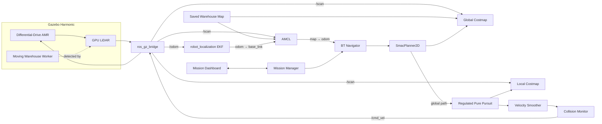

# Architecture

```mermaid
flowchart LR
    subgraph SIM["Gazebo Harmonic"]
        ROBOT["Differential-Drive AMR"]
        LIDAR["GPU LiDAR"]
        WORKER["Moving Warehouse Worker"]
    end

    MAP["Saved Warehouse Map"]
    BRIDGE["ros_gz_bridge"]
    EKF["robot_localization EKF"]
    AMCL["AMCL"]
    GC["Global Costmap"]
    LC["Local Costmap"]
    PLANNER["SmacPlanner2D"]
    RPP["Regulated Pure Pursuit"]
    VM["Velocity Smoother"]
    CM["Collision Monitor"]
    BT["BT Navigator"]
    MM["Mission Manager"]
    DASH["Mission Dashboard"]

    ROBOT --> LIDAR
    WORKER -. detected by .-> LIDAR
    LIDAR --> BRIDGE
    BRIDGE -->|/scan| AMCL
    BRIDGE -->|/scan| GC
    BRIDGE -->|/scan| LC
    BRIDGE -->|/odom| EKF
    MAP --> AMCL
    MAP --> GC
    EKF -->|odom → base_link| AMCL
    AMCL -->|map → odom| BT
    DASH <--> MM
    MM --> BT
    BT --> PLANNER
    PLANNER --> GC
    PLANNER -->|global path| RPP
    RPP --> LC
    RPP --> VM
    VM --> CM
    CM -->|/cmd_vel| BRIDGE
    BRIDGE --> ROBOT
```
